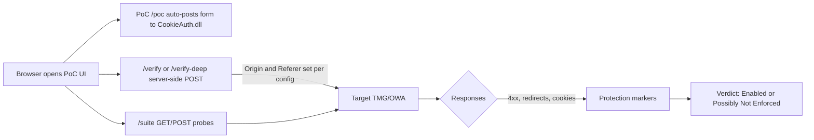

# Enhanced CSRF Assessment Tool for TMG/OWA and Modern Web Applications

> **Disclaimer**
> This enhanced tool is designed for comprehensive CSRF assessment, including dynamic token detection, cookie analysis, and bypass tests. It is intended solely for use in controlled lab environments or for authorized penetration testing and defensive security validation with explicit written permission from the system owner. Do not use this project to violate privacy, break laws, or bypass security controls. The authors and contributors assume no liability for misuse. By using this software, you agree to comply with all applicable laws and policies.

A comprehensive tool for assessing CSRF protection and HTTP normalization in web applications. It includes dynamic token detection, cookie analysis, and bypass tests. This tool is designed to help identify and assess CSRF vulnerabilities in a safe and controlled manner.


## Table of Contents
- [Why](#why)
- [Features](#features)
- [Architecture](#architecture)
- [Project Structure](#project-structure)
- [Getting Started](#getting-started)
- [Usage](#usage)
- [Configuration](#configuration)
- [How the Verdict Works](#how-the-verdict-works)
- [Troubleshooting](#troubleshooting)
- [Security Notes](#security-notes)
- [Roadmap](#roadmap)
- [License](#license)


## Why Use This Tool
This enhanced CSRF assessment tool is designed to help security professionals evaluate the effectiveness of CSRF protections in web applications. It provides:
- Dynamic CSRF token extraction and handling
- Enhanced cookie analysis (SameSite, Secure, HttpOnly flags)
- Auto-detection of authentication endpoints
- Bypass tests (JSON, multipart, custom headers, Fetch Metadata)
- Vulnerability confidence scoring
- CORS misconfiguration detection
- Content Security Policy (CSP) analysis

> Important: This project is for defensive assessment and validation only.


## Features
- Interactive startup prompts with auto-detection of authentication endpoints
- Light/Dark theme toggle (persisted in localStorage)
- Web configuration page for target, public host/port, Origin/Referer, and CSRF credentials
- CSRF Browser PoC (form auto-submit to CookieAuth.dll)
- Server-side verification (basic/deep) with controllable Origin/Referer
- Fetch Metadata (Sec-Fetch-*) header tests
- Comprehensive assessment suite: encoding, path, headers, methods, payload variations
- JSON export of assessment results
- File-based logging (`csrf_assessment.log`)


## Architecture



## Project Structure
```
csrf_poc/
├── csrf_poc_server.py   # Entry point — config, HTTP handler, server startup
├── csrf_engine.py       # Core testing logic, HTTP requests, payload building
├── csrf_analyzer.py     # Cookie analysis, CSP/CORS checks, vulnerability scoring
├── csrf_templates.py    # HTML page generation (all web UI pages)
├── README.MD            # This file
└── README.txt           # Short reference
```

| Module | Lines | Responsibility |
|---|---|---|
| `csrf_poc_server.py` | ~340 | Config loading, interactive prompts, HTTP handler, server startup |
| `csrf_engine.py` | ~360 | Payload building, HTTP requests, endpoint detection, test suite execution |
| `csrf_analyzer.py` | ~125 | Cookie flag parsing, SameSite/Secure/HttpOnly analysis, vulnerability scoring |
| `csrf_templates.py` | ~390 | All HTML page rendering (index, config, PoC, verify, suite, JSON export) |


## Getting Started
### Prerequisites
- Python 3.8+
- `requests` library (install with `pip install requests`)

### Run
```bash
python csrf_poc_server.py
```
You will be prompted for:
- Target base URL (e.g., `https://mail.example.com`)
- Your public IP/host for PoC access
- Listen port

Open the printed public URL in a browser (e.g., `http://YOUR_IP:4444/`).

> Tip: When testing from the same LAN over a public address, your router must support hairpin NAT (NAT loopback). Otherwise use an external client (e.g., mobile network).


## Usage
### Endpoints
| Path | Description |
|---|---|
| `/` | Overview with quick actions, vulnerability score, detected endpoints |
| `/config` | Edit target/public host/port, fake Origin/Referer, CSRF credentials |
| `/poc` | Browser CSRF PoC with tokens |
| `/poc-no-token` | Browser CSRF PoC without tokens |
| `/verify` | Basic server-side verification (single response) |
| `/verify-deep` | Deep verification (follows redirect chain) |
| `/suite` | Full assessment suite (encoding, path, headers, fetch metadata, methods, payloads) |
| `/export/json` | Export assessment results as JSON |

Query parameters for `/verify`, `/verify-deep`, `/suite`, `/export/json`:
- `origin=...` and `referer=...`
- `__NONE__` removes the header (e.g., `origin=__NONE__`)


## Configuration
### Environment Variables
| Variable | Default | Description |
|---|---|---|
| `TARGET_BASE` | `https://example.com` | Target base URL published via TMG |
| `PUBLIC_HOST` | `127.0.0.1` | Your public IP/host for PoC access |
| `LISTEN_HOST` | `0.0.0.0` | Listen address |
| `LISTEN_PORT` | `4444` | Listen port |
| `PUBLIC_PORT` | `LISTEN_PORT` | Public port (for display/Origin defaults) |
| `COOKIEAUTH_PATH` | `/CookieAuth.dll?Logon` | FBA logon endpoint |
| `GET_LOGON_PATH` | `/CookieAuth.dll?GetLogon?...` | Warm-up endpoint |
| `AUTHOWA_PATH` | `/owa/auth.owa` | OWA auth endpoint |
| `PUBLISHED_SAFE_PATH` | `/owa/` | Safe published path for GET probes |
| `CSRF_USERNAME` | `test.user` | Username for FBA form |
| `CSRF_PASSWORD` | `NotARealPass123` | Password for FBA form |
| `CSRF_SUBMIT_NAME` | `SubmitCreds` | Submit field name |
| `CSRF_SUBMIT_VALUE` | `Sign in` | Submit field value |
| `CSRF_FLAGS` | `0` | FBA flags |
| `CSRF_FORCEDOWNLEVEL` | `0` | FBA downlevel flag |
| `CSRF_FORMDIR` | `1` | FBA formdir |
| `CSRF_TRUSTED` | `0` | FBA trusted flag |
| `CSRF_ISUTF8` | `1` | FBA isUtf8 |
| `CSRF_CURL` | `Z2FowaZ2F` | FBA curl value |
| `CSRF_DESTINATION` | `/owa/` | FBA destination |
| `FAKE_ORIGIN` | `http://PUBLIC_HOST:PUBLIC_PORT` | Default Origin for server-side verify |
| `FAKE_REFERER` | _(empty)_ | Default Referer for server-side verify |
| `CERT_FILE` | _(empty)_ | Enable HTTPS if set with KEY_FILE |
| `KEY_FILE` | _(empty)_ | Private key for HTTPS |
| `LOG_FILE` | `csrf_assessment.log` | Log file path |


## How the Verdict Works
Deep verification considers a protection "likely enabled" if any of the following are observed in the response chain:
- HTTP 400/403
- Redirect to `CookieAuth.dll?GetLogon` (any reason)
- Cookie reset patterns (e.g., `expires=Thu, 01-Jan-1970`)

If none are present and the flow reaches `/owa/` with cookies set, it reports "possibly not enforced". Always confirm with server logs.


## Troubleshooting
- **`requests module not installed`** — Install: `pip install requests`
- **UI opens but redirects/calls fail** — Verify `TARGET_BASE` and that the resource is reachable from the helper host
- **Browser PoC shows wrong Origin** — Access the UI via your public URL (host:port) that matches the expected Origin
- **Can't access via public IP from LAN** — Router may lack hairpin NAT; try an external client
- **Port already in use** — Change `LISTEN_PORT` or stop the conflicting service


## Security Notes
- For defensive assessment only. Do not use to bypass controls.
- Credentials are only sent to the configured target and are not logged.
- Prefer testing against a staging environment with test accounts.
- TMG is EOL; consider migrating publication to a supported reverse proxy/WAF.


## Roadmap
- CLI flags to pre-seed config without prompts
- Fetch Metadata validation probes (Sec-Fetch-*) — **done in v2.1**
- JSON export of results — **done in v2.1**
- Modular architecture — **done in v2.1**
- Minimal SOAP probe for EWS (separate, opt-in)
- Automated report generation (PDF/HTML)


## License
MIT
