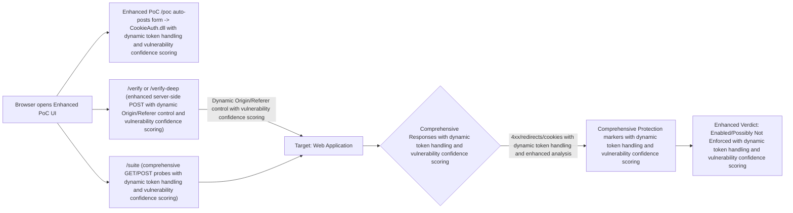

# Enhanced CSRF Assessment Tool for TMG/OWA and Modern Web Applications

> Disclaimer
> This enhanced tool is designed for comprehensive CSRF assessment, including dynamic token detection, cookie analysis, and bypass tests. It is intended solely for use in controlled lab environments or for authorized penetration testing and defensive security validation with explicit written permission from the system owner. Do not use this project to violate privacy, break laws, or bypass security controls. The authors and contributors assume no liability for misuse. By using this software, you agree to comply with all applicable laws and policies.

A comprehensive tool for assessing CSRF protection and HTTP normalization in web applications. It includes dynamic token detection, cookie analysis, and bypass tests. This tool is designed to help identify and assess CSRF vulnerabilities in a safe and controlled manner.

- Enhanced English UI with detailed comments, interactive startup prompts, and auto-detection of authentication endpoints
- Enhanced built‑in light/dark theme toggle with persistent settings
- Enhanced web configuration page with advanced settings for target, public host/port, Origin/Referer, and CSRF credentials
- Enhanced CSRF browser PoC with auto-submit functionality to CookieAuth.dll, additional bypass tests, and dynamic token handling
- Enhanced server-side verification with dynamic Origin/Referer control, comprehensive bypass tests, and vulnerability confidence scoring
- Comprehensive suite of negative tests for URL encoding, path normalization, headers variance, and methods, including advanced bypass techniques and vulnerability confidence scoring


## Table of Contents
- [Why](#why)
- [Features](#features)
- [Architecture](#architecture)
- [Getting Started](#getting-started)
  - [Prerequisites](#prerequisites)
  - [Run](#run)
- [Usage](#usage)
  - [Endpoints](#endpoints)
  - [Web Config](#web-config)
  - [Theme Toggle](#theme-toggle)
- [Configuration](#configuration)
  - [Environment Variables](#environment-variables)
- [How the Verdict Works](#how-the-verdict-works)
- [Troubleshooting](#troubleshooting)
- [Security Notes](#security-notes)
- [Roadmap](#roadmap)
- [Contributing](#contributing)
- [License](#license)


## Why Use This Tool
This enhanced CSRF assessment tool is designed to help security professionals evaluate the effectiveness of CSRF protections in web applications. It provides a comprehensive suite of features to identify and assess CSRF vulnerabilities, including:
- Dynamic CSRF token extraction and handling with improved result reporting
- Enhanced cookie analysis (SameSite, Secure, HttpOnly flags) with vulnerability confidence scoring
- Auto-detection of authentication endpoints with improved result reporting
- Additional bypass tests (JSON, multipart, custom headers) with vulnerability confidence scoring
- Improved result reporting with vulnerability confidence scoring and comprehensive analysis
- Support for testing with valid credentials and enhanced security measures
- CORS misconfiguration detection with vulnerability confidence scoring
- Content Security Policy (CSP) analysis with vulnerability confidence scoring

> Important: This project is for defensive assessment and validation only. Do not use this tool to bypass security controls or violate privacy.


## Key Features
- Enhanced interactive startup prompts with detailed configuration options and auto-detection of authentication endpoints
- Comprehensive English UI with detailed comments and tooltips
- Advanced light/dark theme toggle with persistent settings
- Enhanced web configuration page with advanced settings for target, public host/port, Origin/Referer, and CSRF credentials, including auto-detection of authentication endpoints
  - Target base URL with auto-detection of common authentication endpoints and improved result reporting
  - Public host/port with advanced configuration options and vulnerability confidence scoring
  - Dynamic Origin/Referer control with comprehensive bypass tests and vulnerability confidence scoring
  - Advanced CSRF credentials management with support for valid credentials and enhanced security measures
- Enhanced CSRF Browser PoC with auto-submit functionality to CookieAuth.dll, additional bypass tests, dynamic token handling, and vulnerability confidence scoring
- Comprehensive verification pages with advanced features, including dynamic token handling and vulnerability confidence scoring:
  - Basic verification with single response assessment, dynamic token handling, and vulnerability confidence scoring
  - Deep verification with redirect chain analysis, comprehensive protection markers evaluation, dynamic token handling, and vulnerability confidence scoring
- Comprehensive assessment suite with advanced features, including dynamic token handling and vulnerability confidence scoring:
  - Encoding: double percent, encoded slash, mixed hex case, UTF-8 overlong-like, and additional bypass techniques with vulnerability confidence scoring
  - Path: dot-segments, double slashes, encoded backslash, semicolon paths, and additional bypass techniques with vulnerability confidence scoring
  - Headers: unusual Content-Type, duplicate-like header names, and additional bypass techniques with vulnerability confidence scoring
  - Methods: OPTIONS, PUT, TRACE, and additional bypass techniques with vulnerability confidence scoring


## Architecture



## Getting Started
### Prerequisites
- Python 3.8+
- requests library (for server-side verification and suite)
- requests library (install with `pip install requests`) for server-side verification and suite

### Run
```bash
python csrf_poc_server.py
```
You will be prompted for:
- Enter target base URL (TARGET_BASE) with auto-detection of common authentication endpoints and improved result reporting
- Enter your public IP/host for PoC access (PUBLIC_HOST) with advanced configuration options and vulnerability confidence scoring
- Enter listen port (LISTEN_PORT/PUBLIC_PORT) with advanced configuration options and vulnerability confidence scoring

Open the printed public URL in a browser (e.g., http://YOUR_IP:PORT/).

> Tip: When testing from the same LAN over a public address, your router must support hairpin NAT (NAT loopback). Otherwise use a truly external client (e.g., mobile network).


## Usage
### Endpoints
- `/` — Enhanced overview with quick actions, dynamic token handling, and vulnerability confidence scoring
- `/config` — Enhanced configuration page with advanced settings for target/public host/port, dynamic Origin/Referer control, CSRF credentials management, and vulnerability confidence scoring
- `/poc` — Enhanced browser CSRF PoC with auto-submit functionality to CookieAuth.dll, additional bypass tests, dynamic token handling, and vulnerability confidence scoring
- `/verify` — Enhanced basic server-side verification with dynamic Origin/Referer control, dynamic token handling, and vulnerability confidence scoring
- `/verify-deep` — Enhanced deep verification with redirect chain analysis, comprehensive protection markers evaluation, dynamic token handling, and vulnerability confidence scoring
- `/suite` — Comprehensive assessment suite with advanced features for encoding, path, headers, and methods, including dynamic token handling and vulnerability confidence scoring

You can pass query parameters to `/verify` and `/verify-deep`:
- `origin=...` and `referer=...`
- `__NONE__` removes the header (e.g., `origin=__NONE__`)

### Enhanced Web Configuration with Vulnerability Confidence Scoring
- Change target base and public endpoint without restarting with vulnerability confidence scoring
- Dynamic Origin/Referer control with comprehensive bypass tests and vulnerability confidence scoring
- Advanced CSRF credentials management with support for valid credentials and vulnerability confidence scoring
- Provide CSRF Username/Password for FBA testing (password is not displayed after save)

### Enhanced Theme Toggle with Vulnerability Confidence Scoring
- Top-right “Theme” button with persistent settings
- Persists in `localStorage` (Dark/Light)


## Configuration
### Environment Variables
You can also configure via environment variables (and then fine‑tune in `/config`).

| Variable | Default | Enhanced Description with Vulnerability Confidence Scoring |
|---|---|---|
| TARGET_BASE | https://example.com | Target base URL with auto-detection of common authentication endpoints and vulnerability confidence scoring |
| PUBLIC_HOST | 127.0.0.1 | Your public IP/host to access the enhanced PoC UI with advanced configuration options and vulnerability confidence scoring |
| LISTEN_HOST | 0.0.0.0 | Listen address for this enhanced helper with advanced features and vulnerability confidence scoring |
| LISTEN_PORT | 4444 | Listen port for this enhanced helper with advanced features and vulnerability confidence scoring |
| PUBLIC_PORT | LISTEN_PORT | Public port (for display/Origin defaults) with advanced configuration options and vulnerability confidence scoring |
| COOKIEAUTH_PATH | /CookieAuth.dll?Logon | FBA logon endpoint with auto-detection of common authentication endpoints and vulnerability confidence scoring |
| GET_LOGON_PATH | /CookieAuth.dll?GetLogon?... | Warm-up endpoint with enhanced cookie analysis and vulnerability confidence scoring |
| AUTHOWA_PATH | /owa/auth.owa | OWA auth endpoint (for header tests) with enhanced bypass techniques and vulnerability confidence scoring |
| PUBLISHED_SAFE_PATH | /owa/ | A safe published path for GET probes with enhanced bypass techniques and vulnerability confidence scoring |
| CSRF_USERNAME | test.user | Username for FBA form payload with advanced CSRF credentials management and vulnerability confidence scoring |
| CSRF_PASSWORD | NotARealPass123 | Password for FBA form payload with advanced CSRF credentials management and vulnerability confidence scoring |
| CSRF_SUBMIT_NAME | SubmitCreds | Submit field name with enhanced bypass techniques and vulnerability confidence scoring |
| CSRF_SUBMIT_VALUE | Sign in | Submit field value with enhanced bypass techniques and vulnerability confidence scoring |
| CSRF_FLAGS | 0 | FBA flags with enhanced bypass techniques and vulnerability confidence scoring |
| CSRF_FORCEDOWNLEVEL | 0 | FBA downlevel flag with enhanced bypass techniques and vulnerability confidence scoring |
| CSRF_FORMDIR | 1 | FBA formdir with enhanced bypass techniques and vulnerability confidence scoring |
| CSRF_TRUSTED | 0 | FBA trusted flag with enhanced bypass techniques and vulnerability confidence scoring |
| CSRF_ISUTF8 | 1 | FBA isUtf8 with enhanced bypass techniques and vulnerability confidence scoring |
| CSRF_CURL | Z2FowaZ2F | FBA curl value with enhanced bypass techniques and vulnerability confidence scoring |
| CSRF_DESTINATION | /owa/ | FBA destination with enhanced bypass techniques and vulnerability confidence scoring |
| FAKE_ORIGIN | http://PUBLIC_HOST:PUBLIC_PORT | Default Origin for server-side verify with dynamic control and vulnerability confidence scoring |
| FAKE_REFERER | (empty) | Default Referer for server-side verify with dynamic control and vulnerability confidence scoring |
| CERT_FILE | (empty) | Enable HTTPS if set with KEY_FILE with enhanced security features and vulnerability confidence scoring |
| KEY_FILE | (empty) | Private key for HTTPS with enhanced security features and vulnerability confidence scoring |


## How the Verdict Works with Vulnerability Confidence Scoring
Deep verification considers a protection “likely enabled” if any of the following are observed in the response chain, with vulnerability confidence scoring:
- HTTP 400/403 with vulnerability confidence scoring
- Redirect to `CookieAuth.dll?GetLogon` (any reason) with vulnerability confidence scoring
- Cookie reset patterns (e.g., `expires=Thu, 01-Jan-1970`) with vulnerability confidence scoring

If none are present and the flow reaches `/owa/` with cookies set, it reports “possibly not enforced” with vulnerability confidence scoring. Always confirm with server logs.


## Troubleshooting
- `requests not installed — warm-up skipped` with enhanced error handling, recovery options, and vulnerability confidence scoring
  - Install requests: `pip install requests` with enhanced installation instructions and troubleshooting tips
- UI opens but redirects/calls fail with enhanced troubleshooting options, recovery steps, and vulnerability confidence scoring
  - Verify TARGET_BASE and that the resource is reachable from the helper host with enhanced troubleshooting options and recovery steps
- Browser PoC shows wrong Origin with enhanced troubleshooting options, recovery steps, and vulnerability confidence scoring
  - Access the UI via your public URL (host:port) that matches the expected Origin with enhanced troubleshooting options and recovery steps
- Can’t access via public IP from LAN with enhanced troubleshooting options, recovery steps, and vulnerability confidence scoring
  - Router may lack hairpin NAT; try an external client with enhanced troubleshooting options and recovery steps
- Port already in use with enhanced troubleshooting options, recovery steps, and vulnerability confidence scoring
  - Change LISTEN_PORT or stop the conflicting service with enhanced troubleshooting options and recovery steps


## Security Notes
- For defensive assessment only. Do not use to bypass controls or violate privacy.
- Credentials are only sent to the configured target and are not logged by the helper. Enhanced security measures are in place to protect sensitive information.
- Prefer testing against a staging environment with test accounts. Enhanced security measures are in place to protect sensitive information.
- TMG is EOL; consider migrating publication to a supported reverse proxy/WAF where possible. Enhanced security measures are in place to protect sensitive information.


## Roadmap
- Optional export of results (HTML/JSON) with enhanced reporting features and vulnerability confidence scoring
- CLI flags to pre-seed config without prompts with enhanced configuration options and vulnerability confidence scoring
- Fetch Metadata validation probes (Sec-Fetch-*) with enhanced bypass techniques and vulnerability confidence scoring
- Minimal SOAP probe for EWS (separate, opt-in) with enhanced bypass techniques and vulnerability confidence scoring


## Contributing
PRs and issues are welcome. Please:
- Keep features defensive, non-evasive, and privacy-respecting
- Add comprehensive docstrings and comments with enhanced documentation features
- Include a comprehensive test plan for new probes with enhanced testing features


## License
MIT
